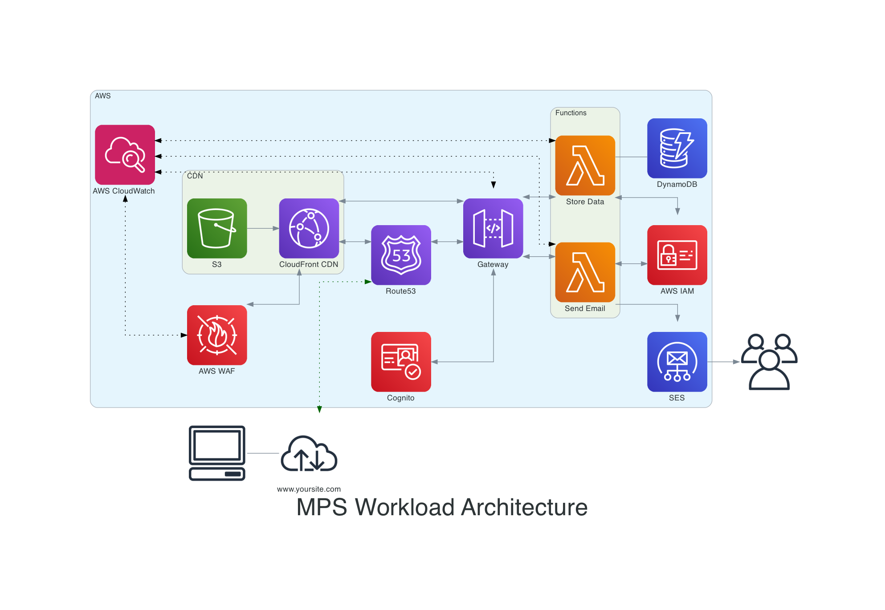

# onp.mps.workload

## Metadata
| attribute               |value                                          |
| ----------------------- | --------------------------------------------- |
| workload-id              | onp.mps.workload           |
| workload-name            | MPS Microservices Application                                     |
| workload-version         | 1.0.0                                        |
| workload-description     | This sample application workloads enables the NPP microservices integration. It uses a variety of patterns from Open Nickel Project and uses NickelCloud for controls evaluation                          |
| organisation-id         | onp                                           |
| pattern-status          | published                                         |
| pattern-categories      | network                                       |

## What is this Workload?
This workloads enabled payments via the NPP. It is used as a stereo type application to deploy microservices that will facilitate the reconsiliations over NPP platform.

## Background
Launched in February 2018, the New Payments Platform (NPP) is open access infrastructure for fast payments in Australia. The NPP was developed via industry collaboration to enable households, businesses and government agencies to make simply addressed payments, with near real-time funds availability to the recipient, on a 24/7 basis. Each payment message is capable of carrying much richer remittance information than other systems (for instance the 18 characters currently available for Direct Entry payments). The NPP infrastructure supports the independent development of ‘overlay’ services to offer innovative payment services to end-users.

In 2012, the Reserve Bank published the Conclusions of the Strategic Review of Innovation in the Payments System, setting out strategic objectives for the Australian payments system. These included the ability for users to make real-time payments; send more complete remittance information with payments; address payments in a relatively simple way; and make and receive payments outside normal business hours. The Bank invited industry to determine the most effective way of delivering on those objectives. It subsequently developed ‘core criteria’, expanding on the initial strategic objectives, in order to provide industry with a more detailed set of expectations and also to serve as a tool against which it could assess any proposals.

In response, an industry committee proposed that a new, purpose-built payments infrastructure, the NPP, be developed. In February 2013, the Payments System Board welcomed the proposal as making substantial initial progress towards meeting the strategic objectives. In 2014, twelve Authorised Deposit Taking Institutions committed to funding of the build and operation of the NPP and became the founding members of NPP Australia Limited.

The Reserve Bank played a significant role in establishing the broad direction of the industry's efforts. It also built the settlement component of the NPP, known as the Fast Settlement Service, which allows transactions to be settled individually on a 24/7 basis, in close to real time. The Bank is also a participant in the project, with its Banking Department using the NPP infrastructure.

## Variables

| Variable               | Source                                         | Value |
| ----------------------- | --------------------------------------------- | ------|
| VPC ARN   | SSM Parameter | onp/network/simplevpcarn|